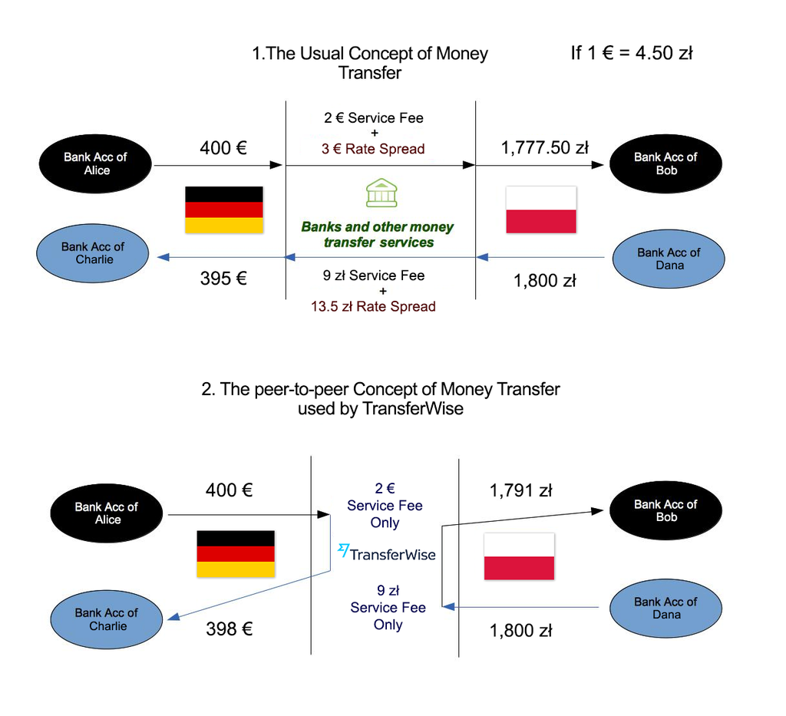
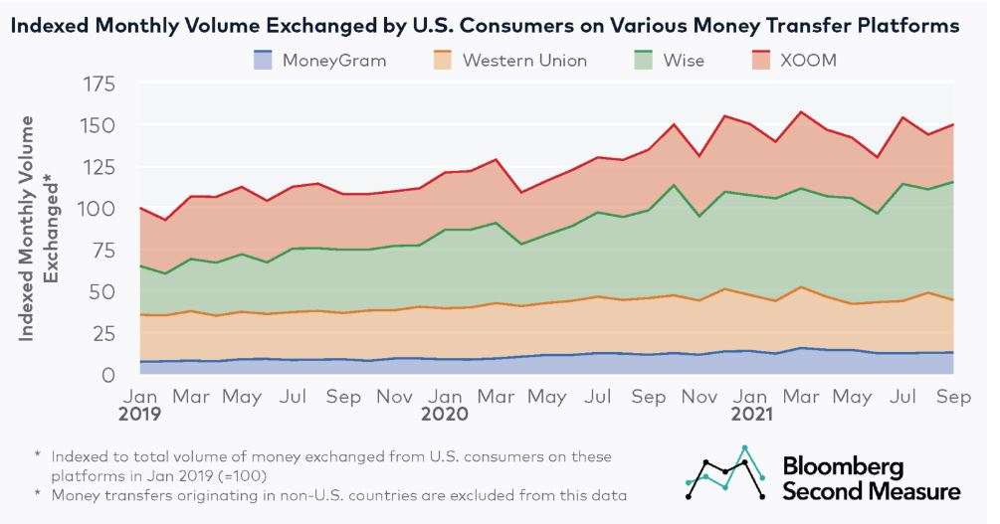
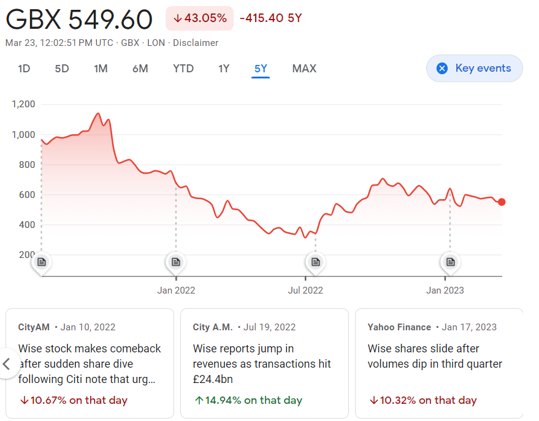

# Case Study: Wise

## Overview and Origin
* Wise (Formerly known as TransferWise)
* Founded January 2011
* Founders Taavet Hinrikus, Kristo Käärmann
* Idea seed: Founders Taavet and Kristo are Estonian expats based in the UK. Having struggled to pay bank fees for every international transaction, they began to exchange euros and pounds between each other and the idea came about to provide international currency exchange with a fraction of bank fees for the masses.

| Seed Funding | Early Stage Funding | Series Funding|
| ----------- | ----------- | ----------- |
| Total $1.3M | Total $31M |Total $683M|
| $1.3 million received from a consortium including venture firms IA Ventures and Index Ventures, IJNR Ventures, NYPPE as well as individual investors such as PayPal co-founder Max Levchin, former Betfair CEO David Yu, and Wonga.com co-founder Errol Damelin.| In May 2013, it was announced that Wise had secured a $6 million investment round led by Peter Thiel's Valar Ventures. Wise raised a further $25 million in June 2014, adding Richard Branson as an investor.| In January 2015, it was announced that Wise had raised a $58 million Series C round, led by investors Andreessen Horowitz. In May 2016, Wise secured a funding of $26 million. This raised the company's valuation to $1.1 billion. As of May 2016, Wise has raised a total of $117 million in funding. In November 2017, the company raised a $280 million Series E led by Old Mutual Global Investors and IVP, as well as Sapphire Ventures, Japanese Mitsui & Co, and World Innovation Lab. In May 2019, the company had the secondary investment round of $292 million and reached the total valuation of $3.5 billion. In July 2020, the company disclosed a secondary investment round of $319 million and reached the total valuation of $5 billion, led by new investor D1 Capital Partners and existing shareholder Lone Pine Capital.| 

## Business Activites:
* Wise offers the benefit of international money transfer at low fees and instant transaction times.
* Wise services are used by customers worldwide. According to their first annual report ['Annual Report and Accounts 2022'](https://lienzo.s3.amazonaws.com/images/2aeb66e27009d06acbd6f46f746feae2-WIS001_Book.pdf), customer market size has exceeded 13 million customers worlwide and 3.5% of personal money moving across boarders is handled by Wise. Having no hidden fees and access to upfront visibility of fees are the advantages that they proudly emphasize on with their marketing strategies.
* Money transfer through wise is based on peer-to-peer concept, in which users are matched based on the currenncy they are looking to sell/buy. The figure below provides a good explanation of how P2P works.

## Landscape:
* Fintech domain: Global Digital Remittance Market
* The emergence of Digital Banks has been a large up and coming innovation in the money remittance domain. Wise has also grown their portfolio to service businesses with Wise Business and Wise Platform.
* Other major companies in the domain include Paypal, Revolut, Remitly, Western Union.  

## Results
* On July 7th 2021, Wise listed on the London Stock Exchange valued at £8 billion, which made it London's largest ever tech listing.
* Key peformance indicators that explain Wise's grrowth are shown below:

| Active customers| Total volume | Personal VPC | Business VPC | Total Take rate |
| ----------- | ----------- | ----------- | ----------- | ----------- |
| 7.4m | £76.4bn | £8,110 | £47,731 | 0.73% |
| YoY 4%| YoY 40%| YoY 9%| YoY 18%| -0.03%|  
* Remitly, which was also founded in 2011, profits from adding a mark-up to the mid-market exchange rate. Revolut only apply the mark-up for non-weekday transfers, uncommon traded currencies and larger sums of transfer. Wise only uses mid-market exchange rate. A Bloomber Second Measure analysis performed on November 2021 revealed that Wise accounts for almost half of the money exchanged by U.S consumers among a selection of at the time leading money transfer platforms.

## Recommendations
* Wise has expanded its business to serve businesses by launching Wise Business by utilizing Open Banking API. Big plans are in way for the company's growth despite its negative stock price trend seen over the years.

* Investing in utilizing blockchain technologies for services such as decentralized finance (DeFi) can be a smart move for the company to steer towards. More and more it seems that the future of finance and banking is accepting the notion of blockchain and cryptocurrencies. Such is seen with Jp Morgan's new JPM Coin which is a stablecoin pegged to the US dollar. 
* Technologies that may be utilized in developing DeFI solutions will require Ethereum smart contract development using Solidity platform. 

---
### *References*
[Wikipedia: Wise (company)](https://en.wikipedia.org/wiki/Wise_(company))

[Tech crunch interview [2012]](https://techcrunch.com/2012/02/29/5-startups-to-watch-from-seedcamps-2012-us-demo-day-tctv/)

[Annual Report and Accounts 2022](https://lienzo.s3.amazonaws.com/images/2aeb66e27009d06acbd6f46f746feae2-WIS001_Book.pdf)

[Remitly vs Revolut -[2023]](https://wise.com/gb/blog/remitly-vs-revolut)

[Wise captures growing share of money transfers from U.S. consumers](https://secondmeasure.com/datapoints/money-transfer-services-wise-western-union-moneygram-xoom-competitors/)